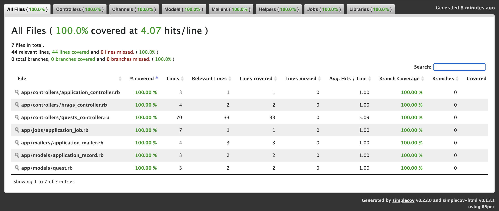

# AcademyQuest

AcademyQuest is a web application for managing quests. Users can create, view, update, and delete quests.

you can visit the live demo at [AcademyQuest](https://academyquest.lynchz.dev/)

---
## TEST Progress


## Test Suite Details

The project includes comprehensive test coverage with:

- **Model Tests**: Testing Quest model attributes, validations, defaults, and persistence
- **Controller Tests**: Testing QuestsController and BragsController actions and responses
- **View Tests**: Testing proper rendering of all Quest views (index, show, edit, new)
- **Feature Tests**: Testing page interactions and content display
- **System Tests**: Testing frontend interactions and styling based on quest status
- **Request Tests**: Testing API endpoints and status updates
- **Routing Tests**: Ensuring proper route configurations
- **Helper Tests**: Testing application and quest helpers

The test suite uses:
- RSpec as the testing framework
- SimpleCov for tracking test coverage (minimum 70% line coverage, 50% branch coverage)
- FactoryBot for test data generation
- Capybara for feature and system testing

 ## Continuous Integration

The project uses GitHub Actions for continuous integration with the following jobs:

### Security Scanning

- **Ruby Security Scan**: Uses Brakeman to scan for common Rails security vulnerabilities via static analysis
- **JavaScript Security Scan**: Audits JavaScript dependencies using Rails Importmap

### Code Quality

- **Linting**: Enforces code style consistency using RuboCop

### Automated Testing

- **Test Suite**: Runs the full test suite including system tests with the following setup:
  - PostgreSQL database service
  - Chrome for system tests
  - Automatic database creation and preparation
  - Test artifacts collection (screenshots from failed system tests)

The CI pipeline runs on every pull request and push to the main branch, helping maintain code quality and catch issues early.

To view the current CI status:
1. Go to the GitHub repository
2. Click on the "Actions" tab
3. View the latest workflow runs

## Technology Stack

- Ruby 3.3.0
- Rails 8.0.2
- PostgreSQL database
- TailwindCSS for styling
- Turbo and Stimulus for frontend interactivity

## Prerequisites

- Ruby 3.3.0
- PostgreSQL
- Node.js and Yarn (for asset compilation)
- Docker (optional, for containerized development)

## Setup Instructions

1. Clone the repository
2. Install dependencies:
   ```
   bundle install
   ```
3. Setup the database:
   ```
   bin/rails db:create db:migrate
   ```
4. Start the development server:
    ```
    bin/dev
    ```

 ## Features

 - Quest management (create, read, update, delete)
 - Status tracking for quests

 ## Running Tests

 Run the test suite with:
  ```
  bundle exec rspec
  ```
